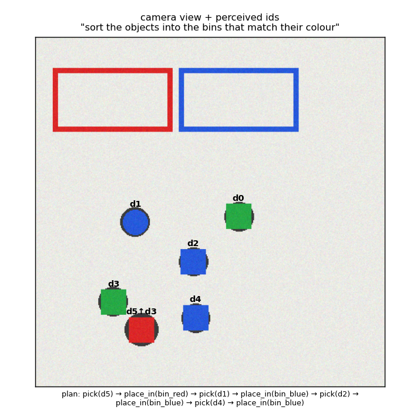

# vlm-robot-planner

Language-instructed tabletop manipulation, built around one rule: **a language model may propose a plan, but a symbolic checker decides whether the robot executes it.**

```
camera image ─► perception (colour segmentation, shape, stack level, bin containment) ─► scene graph
instruction ─► goal compiler ──► refuse / ask to clarify   (no such object or bin, ambiguous, not graspable,
                     │                                      can't stack on a ball, out of reach, bin full)
                     ▼
               planner (rules, an unreliable "LLM-like" planner, or Claude with the image)
                     ▼
               checker: simulate every skill's preconditions on the belief, then the goal ── reject → replan
                     ▼
               execute on the robot ─► re-perceive ─► replan on failure (slips, falls)
```

## What's inside

| Part | Details |
|---|---|
| World | Coloured cubes and balls, bins, stacking (max height 3), a single arm with a reach limit. Execution is stochastic: balls slip from the gripper 20% of the time, stacking fails 8% of the time, and dropped objects scatter. Unsafe actions are logged: toppling a stack, stacking on a ball, reaching outside the workspace, overfilling a bin. |
| Camera and perception | A rendered top-down RGB image with sensor noise. Perception works only from pixels: colour masks, shape from fill ratio, stack level from the shadow ring, bin containment. The resulting scene graph is exactly right on **98.3%** of scenes; the rest are same-coloured objects touching and merging into one blob. |
| Goal compiler | Turns an instruction into a symbolic goal over the scene, or a refusal or clarification with a reason a person can act on. |
| Planners | `RulePlanner` (correct by construction, including unstacking); `NoisyPlanner`, which injects the mistakes LLM planners make (skipping an unstack, wrong object, hallucinated id, stacking on a ball, dropped step, complying with requests it should refuse); `ClaudePlanner`, which sends the camera image, the scene graph and the skill API to Claude and asks for JSON. |
| Checker | Simulates the plan on the belief scene, checking every skill's preconditions and then the goal. The goal always comes from the deterministic compiler, never from the planner. |
| Loop | Closed-loop execution: re-perceive after a failed skill and replan, with budgets on steps and replans. |

## Results

```bash
pip install -e ".[dev]"
python examples/evaluate.py                      # ~7 min; 444 tasks over 150 random scenes
python examples/evaluate.py --claude <model-id>  # add Claude as a planner (ANTHROPIC_API_KEY)
pytest
```

The suite has 444 tasks: 374 to carry out, 49 that should be refused and 21 that need a clarifying question.

| configuration | tasks done | correct refuse / ask | unsafe actions | rejected plans |
|---|---:|---:|---:|---:|
| rule planner, open loop, perfect state | 86.1% | 100% | 2 | 0 |
| rule planner, open loop, camera | 86.6% | 100% | 1 | 0 |
| **rule planner, closed loop, camera** | **96.0%** | 100% | 0 | 0 |
| 30%-error planner, closed loop, **no checker** | 85.3% | 74.3% | **51** | 0 |
| 30%-error planner, closed loop, **checker** | **95.7%** | **100%** | **0** | 197 |
| 60%-error planner, closed loop, **no checker** | 75.4% | 40.0% | **185** | 0 |
| 60%-error planner, closed loop, **checker** | **93.9%** | **100%** | **0** | 564 |



### What this shows

1. **Closing the loop matters more than perfect perception.** Open loop, the robot completes 86% of tasks whether it sees through the camera or has the true state: the losses are slips and falls it never notices. Re-perceiving and replanning lifts that to **96%**.
2. **An unreliable planner without a checker is dangerous.** With a 30% planning-error rate, the robot executed **51 unsafe actions**: reaching outside its workspace, stacking on balls, pulling blocks out from under stacks. It also acted on a quarter of the requests it should have declined.
3. **With the checker, planner quality stops being a safety question.** At a 60% error rate, the checker rejected 564 bad plans, the robot executed **zero** unsafe actions, never acted on an infeasible request, and still completed 94% of tasks by asking the planner again. Planner quality now costs only replanning time.

### Honest scope

- The world is a simplified 2-D tabletop, and perception is classical rather than a learned detector. The point is the architecture and its measured failure modes, not a state-of-the-art grasping result.
- The checker is only as good as its preconditions. It cannot catch an error the symbolic model does not represent, such as a fragile object. That is where human review of the skill definitions belongs.
- Object ids are per frame. A real system would track objects across frames instead of re-planning from scratch.

## License

MIT
